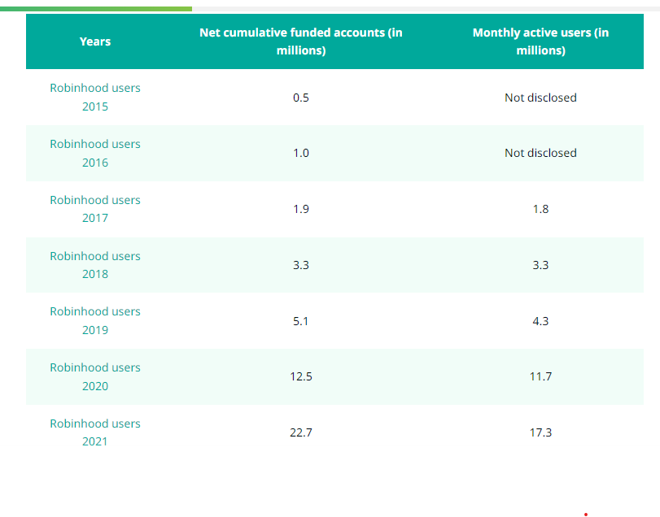
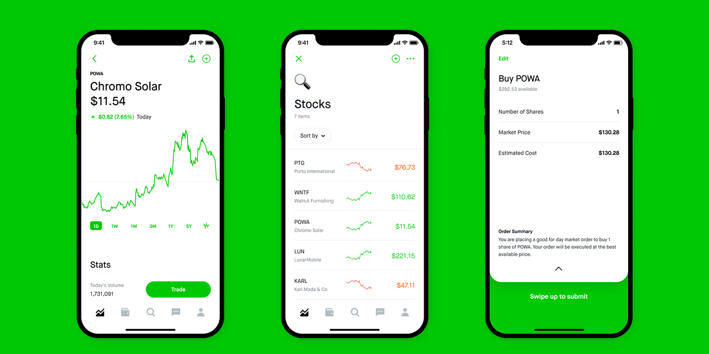

# FinTech Case-Study

## **Overview & Origin**

Robinhood, which was founded by two Stanford gradutes, Vladimir Tenev & Baiju Bhatt, was founded in April of 2013. After graduating from college, Vladimir & Baiju, built and established two finance companies which sold trading software to various hedge funds.

In dealing with various hedge funds, Vladimir & Baiju realized that big Wall Street Firms were essentially paying nothing to trade stocks, while most Americans were charged a commission for every trade that they made (https://robinhood.com/us/en/support/articles/our-story/). Thus, the idea of Robinhood was conceptualized, as a way to provide everyone with access to the financial markets, not just the wealthy. 

In order to expedite it's growth, Robinhood released it's IPO in July of 2021, raising a total of $2.1 B at $38/share. The company has grown exponentially from a revenue and number of user standpoint, nearly doublind year-over-year since it's inception. In order to fuel this growth and expansion the company have offered a total of 28 rounds of founding, raising a total of $6.2B (https://www.crunchbase.com/organization/robinhood/company_financials)
https://investingintheweb.com/brokers/robinhood-statistics/#:~:text=Robinhood's%20revenue%20growth%20has%20been,%2Dyear%20growth%20of%2089%25.

https://investingintheweb.com/brokers/robinhood-statistics/#:~:text=Robinhood's%20revenue%20growth%20has%20been,-year%20growth%20of%2089%25

## **Business Activities**

Robinhood's popularity can be attributed to many factors, setting it apart from it's competitors:

1) Commission-Free Trading
	- What intially set Robinhood apart from it's competitors is it's commission-free trading 	model. Unlike most other comanies at the time, Robinhood allowed it's customers to 	trade stocks stocks, cryptocurrency, options, and ETF's without having to pay a 	commission.
2) User-Friendly Interface
	- Robinhood's simplistic and clean design is a major draw for it's customers, especially 	for first-time investors who are looking for an easy way to invest. Robinhood has 	especially received praise for it's user-friendly mobile interface.
3) Fractional Shares
	- Another major draw of Robinhood is that it allows users to purchase and sell 	fractional shares, which is especially appealing to new investors and those who may not 	have the financial capital to purchase whole shares.
4) Wide array of Purchaseable Assets
	- Apart from offering stocks and ETF'S, Robinhood also offers customers the option to 	purchase cryptocurrency as well, increasing it's appeal amongst investors.
	- 
(https://robinhood.com)

In order to run successfully and support all of it's offerings, Robinhood employs an array of programming languages, including various application & data tools, utilities, DevOps, and business tools to support it's platform. Robinhood's backend infrastructure is predominantly built using Python, a very commonly used programming language (https://stackshare.io/robinhood/robinhood).

Other technologies, such as Django, Bootstrap, Google Analytics, GitHub, Git, Babel, and Slack, amongst many others, are also utilized in creating Robinhood's user-friendly interface https://stackshare.io/robinhood/robinhood).  Not only has Robinhood make it easy for it's customers to trade, but also providers it's users with a platform to provide feedback, allowing for the company to constantly improve and draw even more customers.

## **Landscape**

Robo advisors & personal finance, the financial industry/domain that Robinhood is in, have experienced significant developments over the past 5-10 years. Acorns, Betterment, Wealthfront, M1Finance & Personal Capital, the other major companies in this domain, have all employed the following innovations/trends to become extremely successful in this space.

1) Accessibility
	- Robinhood and other Robo Advisors have made investing easier and more accessible to a broader range of investors, all of which have varying levels of investment knowledge. The introduction of mobile applications and user-frindly interfaces has made it even easier to invest.

2) Cost-Effective
	- Just as Robinhood has introduced commission-free trading, many other Robo Advisor companies have done the same, decreasing the overall capital investment for it's users. Although the cost may not be substantial, it lowers the overall risk of investors and is even more beneficial to those that buy/sell stocks, ETF'S, etc. more frequently.
	
3) Personalizaiton
	- Due to the flooded market of Robo Advisor companies/options, many users are 	looking for a more personalized and customizable investment service/platform. Although 	information is readily available to everyone, investors are looking for a more 	personalized approach to investing which takes into account a more individualized risk 	and goal analysis.
	
Although the competition in the financial service industry is fierce, Robinhood has grown it's user base considerably since first being launched. It's growth has started to slow slightly as more and more companies are being introduced to the space, but it's impact on younger investors still remains especially strong.

