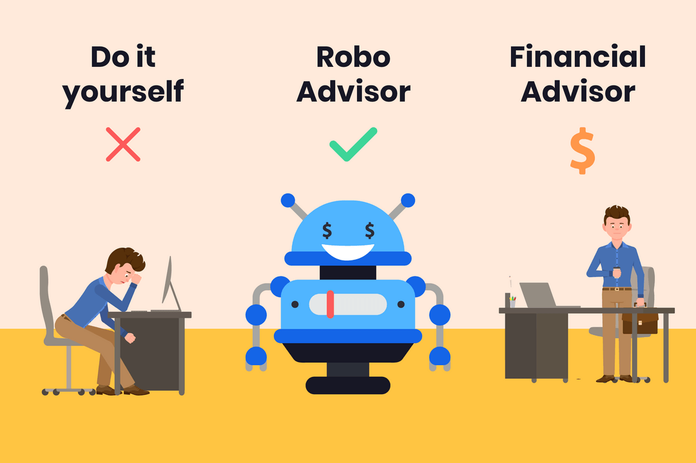

# FinTech Case-Study

## **Overview & Origin**

Robinhood, which was founded by two Stanford gradutes, Vladimir Tenev & Baiju Bhatt, was founded in April of 2013. After graduating from college, Vladimir & Baiju, built and established two finance companies which sold trading software to various hedge funds.

In dealing with various hedge funds, Vladimir & Baiju realized that big Wall Street Firms were essentially paying nothing to trade stocks, while most Americans were charged a commission for every trade that they made (https://robinhood.com/us/en/support/articles/our-story/). Thus, the idea of Robinhood was conceptualized, as a way to provide everyone with access to the financial markets, not just the wealthy. 

In order to expedite it's growth, Robinhood released it's IPO in July of 2021, raising a total of $2.1 B at $38/share. The company has grown exponentially from a revenue and number of user standpoint, nearly doublind year-over-year since it's inception. In order to fuel this growth and expansion the company have offered a total of 28 rounds of founding, raising a total of $6.2B (https://www.crunchbase.com/organization/robinhood/company_financials)
https://investingintheweb.com/brokers/robinhood-statistics/#:~:text=Robinhood's%20revenue%20growth%20has%20been,%2Dyear%20growth%20of%2089%25.

https://investingintheweb.com/brokers/robinhood-statistics/#:~:text=Robinhood's%20revenue%20growth%20has%20been,-year%20growth%20of%2089%25

## **Business Activities**

Robinhood's popularity can be attributed to many factors, setting it apart from it's competitors:

1) ***Commission-Free Trading***
	- What intially set Robinhood apart from it's competitors is it's commission-free trading model. Unlike most other comanies at the time, Robinhood allowed it's customers to trade stocks stocks, cryptocurrency, options, and ETF's without having to pay a commission.
	
2) ***User-Friendly Interface***
	- Robinhood's simplistic and clean design is a major draw for it's customers, especially for first-time investors who are looking for an easy way to invest. Robinhood has especially received praise for it's user-friendly mobile interface.
	
3) ***Fractional Shares***
	- Another major draw of Robinhood is that it allows users to purchase and sell 	fractional shares, which is especially appealing to new investors and those who may not have the financial capital to purchase whole shares.
	
4) ***Wide array of Purchaseable Assets***
	- Apart from offering stocks and ETF'S, Robinhood also offers customers the option to 	purchase cryptocurrency as well, increasing it's appeal amongst investors.
	
(https://robinhood.com)

In order to run successfully and support all of it's offerings, Robinhood employs an array of programming languages, including various application & data tools, utilities, DevOps, and business tools to support it's platform. Robinhood's backend infrastructure is predominantly built using Python, a very commonly used programming language (https://stackshare.io/robinhood/robinhood).

Other technologies, such as Django, Bootstrap, Google Analytics, GitHub, Git, Babel, and Slack, amongst many others, are also utilized in creating Robinhood's user-friendly interface https://stackshare.io/robinhood/robinhood).  Not only has Robinhood make it easy for it's customers to trade, but also providers it's users with a platform to provide feedback, allowing for the company to constantly improve and draw even more customers.

## **Landscape**

Robo advisors & personal finance, the financial industry/domain that Robinhood is in, have experienced significant developments over the past 5-10 years. Acorns, Betterment, Wealthfront, M1Finance & Personal Capital, the other major companies in this domain, have all employed the following innovations/trends to become extremely successful in this space.

1) ***Accessibility*
	- Robinhood and other Robo Advisors have made investing easier and more accessible to a broader range of investors, all of which have varying levels of investment knowledge. The introduction of mobile applications and user-frindly interfaces has made it even easier to invest.

2) ***Cost-Effective*
	- Just as Robinhood has introduced commission-free trading, many other Robo Advisor companies have done the same, decreasing the overall capital investment for it's users. Although the cost may not be substantial, it lowers the overall risk of investors and is even more beneficial to those that buy/sell stocks, ETF'S, etc. more frequently.
	
3) ***Personalizaiton***
	- Due to the flooded market of Robo Advisor companies/options, many users are 	looking for a more personalized and customizable investment service/platform. Although 	information is readily available to everyone, investors are looking for a more 	personalized approach to investing which takes into account a more individualized risk 	and goal analysis.
	
Although the competition in the financial service industry is fierce, Robinhood has grown it's user base considerably since first being launched. It's growth has started to slow slightly as more and more companies are being introduced to the space, but it's impact on younger investors still remains especially strong.

## **Results**

Robinhood has had a mjor impact on the financial services industry and continues to remain a leader in the Robo Advisors domain. Robinhood's commission-free trading model was a major discruption to hedge funds and brokerages nationwide. The ability to offer it's customers lower costs than other major institutions was a major intial draw to the company and forced other companies to adjust their fee structures. "In the fall of 2019, E-Trade, along with peers TD Ameritrade (AMTD) and Charles Schwab (SCHW) finally bit their lip and started offering free stock trading as well" (Divine, 2019) https://money.usnews.com/investing/investing-101/articles/how-robinhood-changed-an-industry

Many of Robinhood's competitors had no choice but to follow Robinhood's path, offering commission-free trading to it's customers. Although many of the companies were a lot larger than Robinhood at the time, each was impacted significantly, especially from a stock standpoint. "On Oct. 1, the day Charles Schwab did away with online commissions, SCHW stock fell 10%; TD Ameritrade shares fell 26% and E-Trade took a 16% haircut" (Divine, 2019). 

Companies in the robo advisors and personal finance domain typically use an array of core metrics to measure and evaluate their performance. These metrics, which include revenue & fee income, cost analysis, assets under management, client growth & retention, average account size and customer service, amongst many other, are typically used in comparing competitors in this space.

Although Robinhood faces stiff competition in the robo advisors domain, it's revenue strucutre is set up for the company to succeed. Although the comapny offers commission-free trading, it generates revenue through many different streams. " Essentially, when a person trades on the app, Robinhood sends that trade to a larger entity, which is able to leverage thousands of orders at once for a slight advantage. The larger entity then compensates Robinhood for the orders" (Curry, 2023: "Robinhood Revenue and Usage Statistics"). This process accounts for more than half of Robinhood's revenue, while it's various advertisement and premium offerings (Robinhood Gold). 

This industry has become extremely lucrative for the companies involved and will only continue to expand as we have more technological advances. "Robinhood generated $1.81 billion revenue in 2021, a 90% year-on-year increase (Curry, 2023: "Robinhood Revenue and Usage Statistics"). 

## **Recommendations**

Although Robinhood's customer base has grown exponentially since it's inception, there still are ways for the company to improve to increase their overall market cap. In order to do so, I would recommend that Robinhood expand it's investment offerings, particularily in cryptocurrnecy, bonds, and mutual fonds. Although Robinhood offers cryptocurrecny, it is very limited in the number of alt coins/cryptocurrency that it offers, forcing users to rely on other exchanges/wallets to purchase/hold their cryptocurrency, many of which charge substanital fees.

As companies, even in different financial domains, begin to expand their offerings in cryptocurrency and other assets, it seems as though Robinhood is hesitant to develop and offer more products. Coinbase, which has led the way in cryptocurrency since it's inception, "generated $3.1 billion in revenue in 2022" and increase it's total asset offerings to $89.7 billion in 2022, a 321.75% increase from 2021" (Curry, 2023: "Coinbase Revenue and Usage Statistics (2023)").

Although it would require a substantial capital investment in technology and possibly an aqusition(s), if Robinhood can expand it's investment offerings and create a more encompassing company which offers many diferent facets of investment opportunities to investors, I think it truly can become the top company in this domain. This would not only attract young/new investors, but also those that are looking to expand their investments and branch into other forms of investing.

In order to expand, a large investment must be made in cloud infrastructure, this would help expedite scalability exponentially and provide the company with the means to expand. More research/investment in Data would also be very important to help determine exactly what products and services should/are worth it for the company. This would help determine whether or not it's financially feasible to offer the service or product. Another upgrade that would be required is to upgrade/implement the new products/features in their mobile environment. Robinhood's user-friendly interface has proved to be a major impact on it's customer base and imrpoving that even further would help ease the transition for newer customers. Last, but certainly not least, a bigger investment in security and date breaches. Regardless of how great a product/company may be, if they're accustomed to security breaches or data loss, they'll lose customers at a fairly high rate. These customers will be highly unlikely to return to the platfrom and can prove to be especially harmful from both a PR standpoint and overall experience standpoint for new and exisiting customers.

Although these upgrades may not be possible, as the domain of Robo Advisors & Personal Capital continues to expand, companies, including Robinhood, will have no choice but to expand and keep up with the emerging markets.

